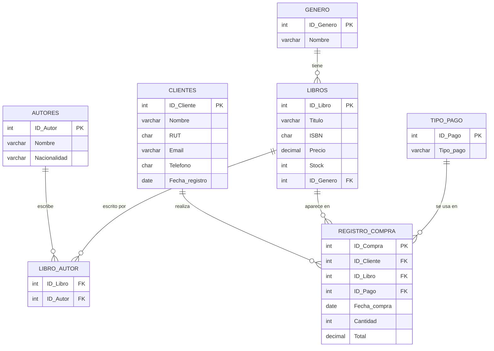

# Base de datos - Libreía

Sistema de base de datos relacional para una librería, que permite gestionar clientes, libros, autores, géneros literarios y registro de compras. Diseñado y normalizado hasta la Tercera Forma Normal (3FN).

| Tabla | Descripción |
|---|---|
| **CLIENTES** | Almacena los datos personales de cada cliente: nombre, RUT, email, teléfono y fecha de registro |
| **GENERO** | Clasifica los libros por género literario: Literatura Infantil, Fantasía, Clásica, Arte, Cine |
| **AUTORES** | Guarda información de los autores: nombre y nacionalidad |
| **LIBROS** | Contiene los datos de cada libro: título, ISBN, precio, stock y género al que pertenece |
| **LIBRO_AUTOR** | Tabla puente que representa la relación N:M entre LIBROS y AUTORES. Un libro puede tener varios autores y un autor puede haber escrito varios libros |
| **TIPO_PAGO** | Define los métodos de pago disponibles: Efectivo, Débito, Crédito |
| **REGISTRO_COMPRA** | Registra cada compra realizada, vinculando cliente, libro y método de pago, junto con fecha, cantidad y total |


##  Diagrama de relaciones
 

 
---

##  Preguntas
 
**1. ¿Qué compró cada cliente, cuándo y cómo pagó?**

Permite ver el historial completo de compras con nombres reales de cliente, libro, género y método de pago.
 
**2. ¿Qué autores escribieron cada libro?**

Permite visualizar la relación N:M entre libros y autores, mostrando todos los autores de cada libro junto con su nacionalidad y género literario.
 
**3. ¿Cuánto ha gastado cada cliente en total?**

Permite identificar los clientes más activos y el monto total que han invertido en la librería.

## Función: `total_compras_cliente`
 
```sql
SELECT total_compras_cliente(1);
```
 
**¿Qué hace?**
Recibe el `ID_Cliente` como parámetro y retorna el monto total que ese cliente ha gastado en todas sus compras.
 
**¿Por qué es útil?**
Permite consultar rápidamente el historial de gasto de un cliente específico sin necesidad de escribir una consulta compleja cada vez. Es especialmente útil para sistemas de fidelización o descuentos por volumen de compra.
